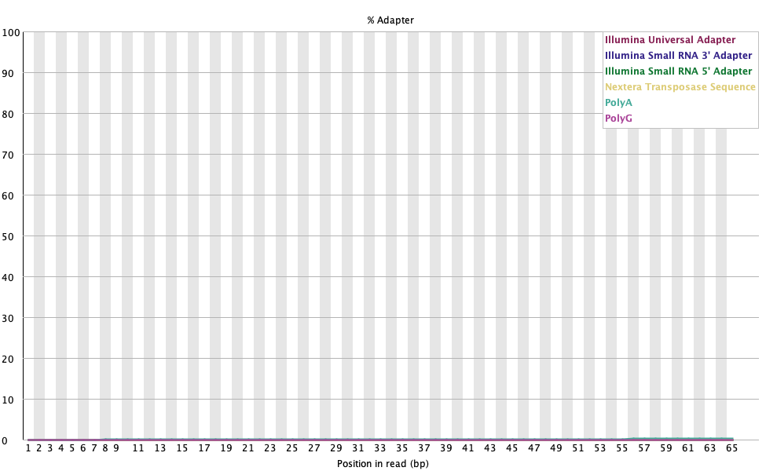
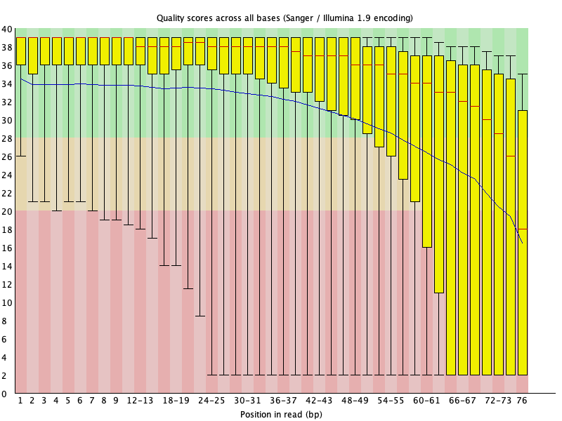
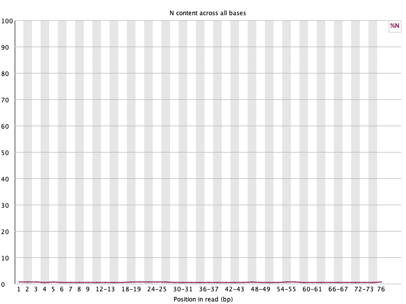
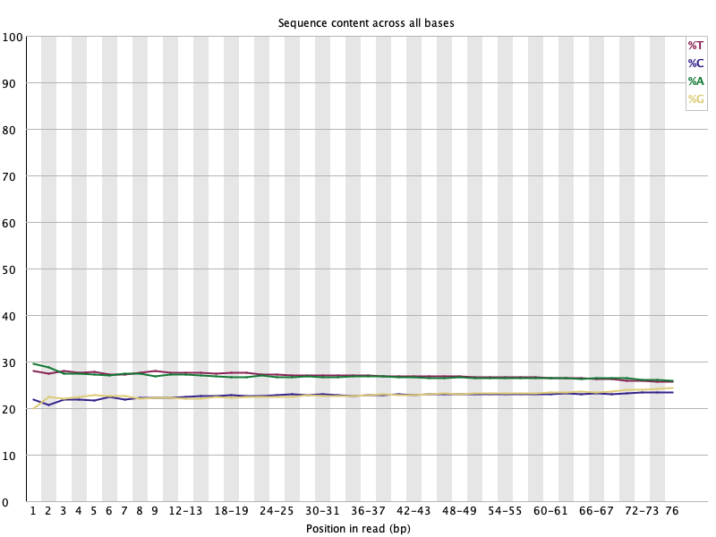
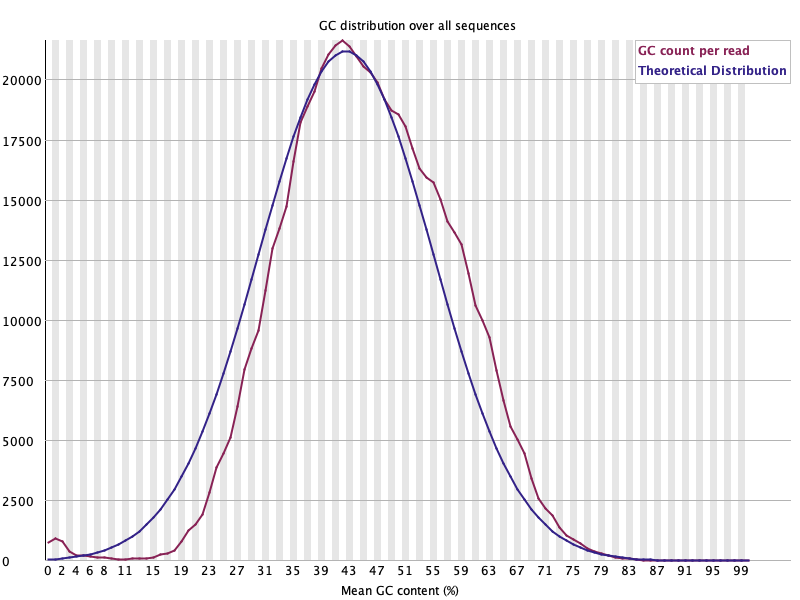
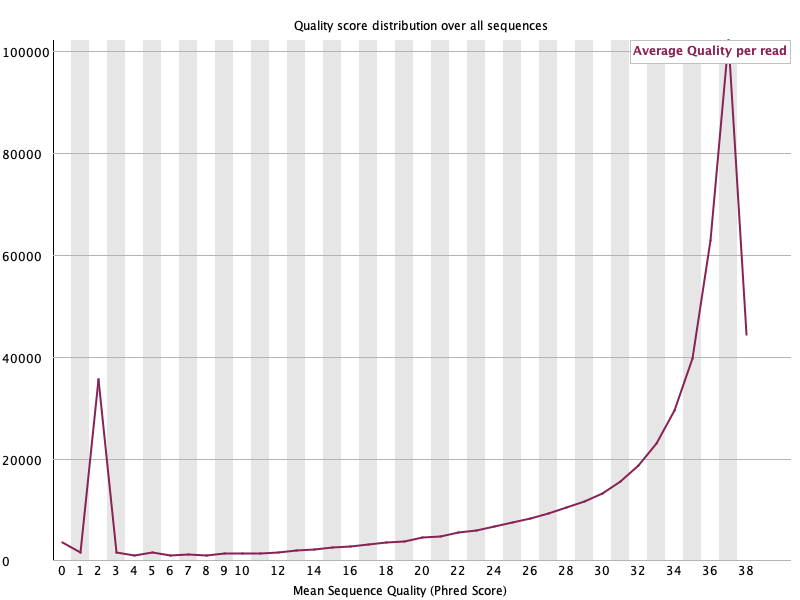
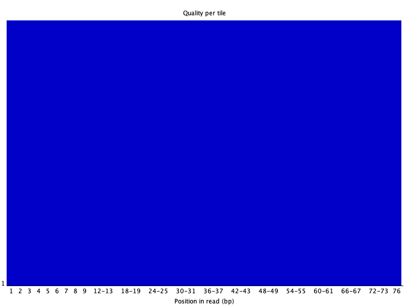
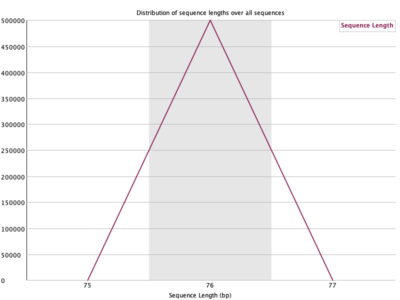
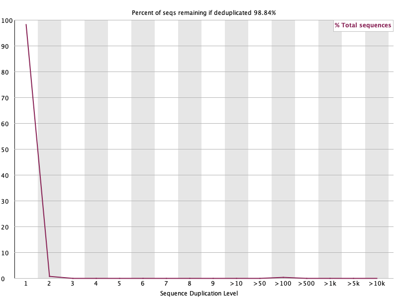

```{r setup, include=FALSE}
knitr::opts_chunk$set(echo = TRUE)
```
# BMEG 424 Assignment 0: Introduction and Pipelines
## Introduction:
### General Information About Assignments
We would like to begin by reminding you of some of the key rules and regulations you will have to follow for the assignments in this course:

- All assignments are to be completed individually or with one partner
  
- If you choose to work in pairs for an assignment, **ONE** of you should make a submission on canvas. In the submission you **MUST** report the name & student number of BOTH partners. 

- Each time you work with a new partner you will need to create a new GitHub repo for that assignment. You should share your repos with the @BMEGGenoInfo account on Github so TAs have access to your submission.

- Late assignments will have 10% deducted for each day they are late and assignments will not be accepted >3 days late. Making changes to the files on your repo after the assignment has been submitted on Canvas will result in a late penalty unless an instructor has specifically asked you to change something.

- Each student will have to ensure their assignment files are knit correctly (see below for instructions) and legible on GitHub. 20% or more of the assignment marks can be removed at the TA's discretion for incorrect knitting or formatting of assignment files.

- We are aware that some of you will choose to use large language models like ChatGPT to complete some portions of the assignment. You are free to use ChatGPT or other LLMs to help you on the assignment, *provided you cite the model and a link to the conversation* (see [here](https://help.openai.com/en/articles/7925741-chatgpt-shared-links-faq) for how to do this with ChatGPT)

- More generally, it is a requirement that you include any and all sources from where you received help (excluding your previously mentioned partner) or information for completing any question on the assignments. If you are unsure of when/how to cite your sources (including LLMs), please get in contact with the instructors.
  
If any of these rules are unclear please get in contact with the instructors. 

### Data 
The data for this assignment is located at `/projects/bmeg/assignments/A1/`. You will be working with a subset of sequencing data from a patient. The data is in the fastq format.

### Software 
Before you begin working on this assignment, you'll need to create a conda environment with all of the relevant software tools installed. You can do this by locating the yaml file in `/projects/bmeg/A1/` and running `conda env create -f /projects/bmeg/A1/A1_environment.yaml --prefix <path_to_your_env>`. You can then activate your environment by running `conda activate <path_to_your_env>`.

The tools you will be using for this assignment are:
- fastQC (https://www.bioinformatics.babraham.ac.uk/projects/fastqc/): comprehensive quality control measures of sequencing data.
- bowtie2 (http://bowtie-bio.sourceforge.net/bowtie2/index.shtml): alignments of sequencing data.
- htop & screen: bash system tools to visualize the server capacity and to run commands in the background, respectively
- samtools (http://www.htslib.org/): manipulation of sequencing data.
- mpileup: a part of samtools which is used for variant calling from sequencing data. Will be installed with samtools.
- bcftools (http://www.htslib.org/): a part of samtools which is used for variant calling from sequencing data. Will be installed with samtools.


### Goal
The purpose of this assignment is to introduce you to the tools (command line and R) and concepts (reproducibility, parallelization, data manipulation etc.) that you will use throughout the course. This assignment focuses on the construction of pipelines, which are useful for ensuring your analysis is reproducible and efficient. 

For this assignment we will be working with patient samples, and using Snakemake to build a pipeline for calling variants from sequencing data. Note that you really don't need any understand of what variant calling is to complete this assignment, and we will cover it in more detail later in the course. 

### Submission:
Submit your assignment as a knitted RMarkdown document. You will push your knitted RMarkdown document to your github repository (one for each group). You will then submit the link, along with the names and student numbers of all students who worked on the assignment to the assignment 1 page on Canvas. Your assignment should be submitted, and your last commit should be made, before 11:59pm on the day of the deadline. Late assignments will will be deducted 10% per day late. Assignments will not be accepted after 3 days past the deadline.

Please ensure you have knit your file to the "github_document" format before submitting. If the file is not viewable on Github without downloading, it will be considered improperly formated and will be subject to the 20% markdown.

## Experiment and Analysis (20.75 pts):
### Part 1: Pipelines
Pipelines are a useful way to organize and automate your analysis of data. They allow you to set up a series of steps in a predefined and predictable order. This may seem like a waste of time on these assignments where you are only analyzing a single or a handful of samples, but it will be essential when you are analyzing hundreds or thousands of samples.

#### a. Setting up a pipeline
For this course we will be using a pipeline manager called Snakemake (https://snakemake.readthedocs.io/en/stable/). Snakemake is a python based pipeline manager which will easily interface with conda and your various software tools installed thereby. Snakemake also handles many of the common issues in pipeline management like parallelization, dependency management, error handling, and run configuration/customization.

First we'll need to add snakemake to our conda environment. You can do this by typing `conda install -c bioconda snakemake` into the command line. 
 
First create a directory within your A1 directory called "pipeline". Then create a file called "Snakefile" within the pipeline directory. 

Snakemake uses a python based syntax to define the steps in your pipeline, these steps are called "rules". Each rule has a set of inputs, and a set of outputs. Rule are dependent on one another based on their inputs and outputs. For example, if rule A has an output which is the input for rule B, then rule B will not run until rule A has completed. Rules which are not dependent on one another will run in parallel. 

Create your Snakefile in the pipeline directory. Here is an example of the rule for running fastqc on your input data (which should now be in ~/A1/).
```
rule fastqc:
    input:
        "/path/to/data/{sample}_1.fastq.gz", # Please move the data to your A1 directory, and replace this path with the correct path
        "/path/to/data/{sample}_2.fastq.gz"
    output:
        "fastqc/{sample}_1_fastqc.html",
        "fastqc/{sample}_2_fastqc.html"
    shell:
        "fastqc {input} --outdir fastqc"

```


You can see that the rule has an input and an output. The input is the path to the raw sequencing data, and the output is the path to the fastqc output. The shell command is the command that will be run when the rule is executed.

#### b. Running the pipeline
Our pipeline will consist of the following steps:
- Quality control of the raw sequencing data (fastqc)
  
- Alignment of the sequencing data to the reference genome (bowtie2, paired-end using both forward and reverse reads and the hg38 genome)
  
- Sorting the aligned data (samtools)
  
- Variant calling (bcftools; installed with samtools)

It is up to you to implement the remaining steps:

```
#?# 1. Fill in the rest of the Snakefile to include rules for sorting the aligned data, indexing the sorted data, and calling variants. (5 pts)
configfile: "config.yaml"

rule all:
    input:
        expand("fastqc/{sample}_1_fastqc.html", sample=config['samples']),
        expand("fastqc/{sample}_2_fastqc.html", sample=config['samples']),
        expand("aligned/{sample}.sam", sample=config['samples']),
        expand("sorted/{sample}.bam", sample=config['samples']),
        expand("sorted/{sample}.bam.bai", sample=config['samples']),
        expand("variants/{sample}.vcf", sample=config['samples'])

rule fastqc:
    input:
        "/Users/ntkien20/Desktop/BMEG/assignment1/{sample}_1.fastq.gz",
        "/Users/ntkien20/Desktop/BMEG/assignment1/{sample}_2.fastq.gz"
    output:
        "fastqc/{sample}_1_fastqc.html",
        "fastqc/{sample}_2_fastqc.html"
    shell:
        "fastqc {input} --outdir fastqc"

rule align:
    input:
        "/Users/ntkien20/Desktop/BMEG/assignment1/{sample}_1.fastq.gz",
        "/Users/ntkien20/Desktop/BMEG/assignment1/{sample}_2.fastq.gz"
    output:
        "aligned/{sample}.sam"
    shell:
        "bowtie2 -x /Users/ntkien20/Desktop/BMEG/assignment1/hg38/hg38_bowtie2_index "
        "-1 {input[0]} -2 {input[1]} -S {output}"

rule samtools_sort:
    input:
        "aligned/{sample}.sam"
    output:
        "sorted/{sample}.bam"
    shell:
        "samtools sort -T sorted/{wildcards.sample} -O bam {input} > {output}"

rule samtools_index:
    input:
        "sorted/{sample}.bam"
    output:
        "sorted/{sample}.bam.bai"
    shell:
        "samtools index {input}"

rule bcftools_call:
    input:
        genome="/Users/ntkien20/Desktop/BMEG/assignment1/hg38/hg38.fa",
        bam="sorted/{sample}.bam",
        bai="sorted/{sample}.bam.bai"
    output:
        "variants/{sample}.vcf"
    shell:
        "bcftools mpileup -f {input.genome} {input.bam} | "
        "bcftools call -mv -Ov -o {output}"

ChatGPT was used here. However, since I couldn't export the chat, I attached a word document of the entire conversation onto Canvas. I first wrote the pipeline code and had ChatGPT looked over it for me. I was particularly stuck on the bcftools_call, since the example on the main website didn't help.
```

Before you start running your snakefile you will need to make sure it is set up correctly. You can type `snakemake -np` into the command line to check that your snakefile is set up correctly. Note this will only work if your snakefile is called "Snakefile" and is in your current working directory. 

You should also check to see that the dependency map of your snakefile is correct. Once you have confirmed that your snakefile is set up correctly you can type `snakemake --dag | dot -Tsvg > dag.svg` into the command line to generate a dependency map of your snakefile. You can view the dependency map by typing `eog dag.svg` into the command line. 

```{bash, eval=FALSE}
#?# 2. Include the dependency map of your Snakefile below using Rmarkdown syntax (1 pts)

# The correct Rmarkdown syntax is 

```


```{bash, eval=FALSE}
#?# 3. Explain what the dependency map is showing and whether or not you think it is correct. (1 pts)
I think the dependency map is showing the workflow of the pipeline.
```

Run your pipeline on the sequence data provided. You can do this by typing `snakemake --use-conda --cores=1 --resources mem_mb=4000` into the command line. You can use screen and htop to check the server usage and determine the correct number of resources to allocate (NOTE: If you don't pass any resources to snakemake it will use all available resources on the server, which is very inconsiderate to your classmates). **Please do not exceed 4GB of memory per job or a single core**, use less if you think it's necessary. 

```{bash, eval=FALSE}
#?# 4. Paste the output of snakemake here (0.25 pts)

```
### Part 2: Quality Control
#### a. Quality Control of raw sequencing data
Download the fastqc reports from the fastqc directory and include each of the graphs in your Rmarkdown file the same way you included the dependency map. 

```
#?# 5. Include the fastqc graphs from the QC on the forward read (read 1) file in your Rmarkdown file below this block. For each graph include a brief description of what the graph is showing and whether or not you think the data passed the quality control. (5 pts) 
# Please try to separate your descriptions by including an text block between for description. 
```
##Adapter Quality

/Users/ntkien20/Desktop/BMEG/assignment1_bgme/assignment1

This graph shows the percentage of reads containing adapter sequences across different positions in the read

## Per Base Sequence Quality

This graph shows the Phred quality score distribution for each base position in the read. Overall, the majority of reads are in the green zone, which means they have good quality.

## Per base N Level

This graph shows the percentage of the N bases. The graph shows a low and consistent N content across all positions, suggesting good quality

## Per base sequencing content

This graph shows us the proportion of each of the four nucleotide (A, T, G, C) in the read. The sequencing content is uniform across all read.

## Per sequence gc content


## Per Sequence Quality Scores

This graph shows the GC content distribution of the reads. The data passes for GC content in all reads.

## Per Tile Quality

This graph shows base-calling quality scores, and it shows universal quality across. 

## Sequence Length Distribution

This graph shows the read lengths in the sequencing data.

## Duplication Level

This graph shows the proportion of duplicated sequences. The results are within acceptable limit

... 

### b. Quality control of the alignment
For this section we will be using samtools to check the alignment of our data.

```
#?# 6. Use samtools flagstat to check the alignment rate of the sample you ran. Paste the output below (0.5 pts) and explain what the output means (1.5 pts)

1000000 + 0 in total (QC-passed reads + QC-failed reads)
1000000 + 0 primary
0 + 0 secondary
0 + 0 supplementary
0 + 0 duplicates
0 + 0 primary duplicates
924585 + 0 mapped (92.46% : N/A)
924585 + 0 primary mapped (92.46% : N/A)
1000000 + 0 paired in sequencing
500000 + 0 read1
500000 + 0 read2
898442 + 0 properly paired (89.84% : N/A)
914236 + 0 with itself and mate mapped
10349 + 0 singletons (1.03% : N/A)
3180 + 0 with mate mapped to a different chr
1857 + 0 with mate mapped to a different chr (mapQ>=5)

There were 1,000,000 reads in total, all of them being primary reads with no secondary, no supplementary, no duplicatres, and no primary duplicates. 92.46% were mapped to the reference genome hg38. There were an equal amount of forward and reverse read. Within these reads, 89.84% were properly paired, and 91.42% of the reads were mapped. The number of mate mapped to a different chromosome were fairly low, indicating that the reads were of good quality.
```

### Part 3: Visualization and Downstream Analysis
#### a. Setting up a reproducible analysis in R
**Reminder that you will be doing your analysis in RStudio on your local computer.**
Before you start analyzing the sequencing data, we will go over some essential methods for reproducible analysis in R. Generally installing packages in RStudio is very easy, with packages being maintained on the CRAN repository. For example to install the common ggplot visualization package in RStudio:

```{r, eval=FALSE}
install.packages("ggplot2")
```

or to install from Bioconductor, you can use the BiocManager package:

```{r, eval=FALSE}
if (!requireNamespace("BiocManager", quietly = TRUE)) {
    install.packages("BiocManager")
}
BiocManager::install("<package-name>")
```
However RStudio does not generally save which versions of packages you had installed at the time of a particular analysis, so if you were trying to reproduce your analysis at a later date you might run into serious headaches either updating the code or trying to install (potentially hundreds of) outdated packages and dependencies. In order to solve this issue you can use package managers which work similarly to how conda managed our command line software. In this course we will be using the renv package. 

```{r, eval=FALSE}
install.packages("renv")
```

An R library is a directory on your computer where R stores all the packages you have installed. You can see where your system library is by typing `.libPaths()` into your R interpreter. Normally when you type `install.packages()` into your R interpreter you install (from a repository like CRAN or Bioconductor) into what's caled the system/global library. This is the equivalent of installing software directly onto your computer instead of within a conda environment in that the global library will be shared across all projects. This is a remarkably bad practice with regards to reproduciblity and project-based analysis. 

Once you have renv installed you can create a new library by typing `renv::init()` into your R interpreter. This will create a new library in your current working directory. You can then install packages into this library by typing `renv::install()` into your R interpreter. You can also install packages from a specific repository by typing `renv::install("package_name", repos = "https://cran.rstudio.com")` into your R interpreter. Because renv doesn't interfere with existing package management workflows you can still use `install.packages() ` and `BiocManager::install()` to install packages into your project library so long as you've initialized renv in your project.

#### b. Basics of R Analysis
For this section you will want to install tidyverse (https://www.tidyverse.org/), a collection of packages for data manipulation and visualization. We will need it for the ggplot2 package which it includes. 

#?# 7. Below is an R function for reading a VCF file and counting the number of occurrences of each unique ref-alt pair in all of the SNPs present in the VCF file. There are a few bugs in the code. Debug the function (2 pts) and add comments to explain what each line of code is doing (1 pts). 
```{r}

count_SNPs <- function(file_path) {
  vcf_data <- read.table(file_path, header = FALSE, stringsAsFactors = FALSE) #This line reads the vcf file from the file path and saves it to vcf_data
  header_line <- grep("^#CHROM", readLines(file_path), value = TRUE) #This line fixes the first bug. It is needed because the subsequent line has header_line, which is not defined. It reads the line from the vcf file and searches for the "^#CHROM" pattern and returns the entire line
  header_names <- unlist(strsplit(header_line, "\t")) #This line will split the header_lines into substrings that begins with the tab characeter "\t"
  colnames(vcf_data) <- header_names #This line will assign header_lines as the column name for the vcf dataframe

  ref_alt_data <- vcf_data[, c("REF", "ALT")] #This line selects only the reference and alternate allele columns from the vcf data frame
  ref_alt_data <- ref_alt_data[apply(ref_alt_data, 1, function(x) all(nchar(x) == 1)), ] #This line checks for rows with only 1 character for single nucleotide polymorphism

  counts <- table(ref_alt_data$REF, ref_alt_data$ALT) #This line makes a table that counts whenever there is a pair of REF and ALT

  result_df <- data.frame(
      REF = rep(rownames(counts), each = ncol(counts)),
      ALT = rep(colnames(counts), times = nrow(counts)),
      COUNT = as.vector(counts)
  ) #This makes the table into a dataframe

  return(result_df)
}

##This was done with the help of ChatGPT. The link to the chat is here https://chatgpt.com/share/678f4c33-e664-8005-afa9-54b7746adb34. ChatGPT was used to help visualize a VCF format, as well as identifying the bugs. I then examined the lines that ChatGPT suggested and studied them. 
```

#?# 8. Use the returned data frame to plot the ref-alt pairs for all SNPs as a bar plot (1 pts)

```{r}
file_path <- "/Users/ntkien20/Desktop/BMEG/assignment1_bgme/assignment1/pipeline/variants/subset_SRR099957.vcf"
snp_count <- count_SNPs(file_path)

library(ggplot2)
snp_graph <- ggplot(snp_count, aes(x = interaction(REF, ALT), y = COUNT)) +
  geom_bar(stat = "identity", fill = "pink") +
  labs(
    title = "Number of REF-ALT pairs for all SNPs",
    x = "REF-ALT Pair",
    y = "Count"
  ) +
  theme(axis.text.x = element_text(angle = 45, hjust = 1)) +
  theme_minimal()

print(snp_graph)

##This was done with the help of ChatGPT. The link to the chat is here https://chatgpt.com/share/678f4c33-e664-8005-afa9-54b7746adb34. ChatGPT was used to help visualize the ggplot code nedded. 
```
#?# 9. Included in the assignment repo is a plot which shows the distribution of **variants** across the genome. You can download and view this plot manually. Recreate this plot using the data from your sample. Include the original svg and your recreation in your submission. (4 pts)
```{r}
# HINT: You'll want to start by looking at the documentation for the GenomicRanges and GenomicDistributions packages.
# We know this question requires a deep dive into the documentation, this is by design as learning how to implement novel tools/packages is a key skill in bioinformatics.
library(GenomicRanges)
library(GenomicDistributions)
library(VariantAnnotation)

vcf_file <- "/Users/ntkien20/Desktop/BMEG/assignment1_bgme/assignment1/pipeline/variants/subset_SRR099957.vcf"
vcf_data <- readVcf(vcf_file, "hg19")
gr_sample <- rowRanges(vcf_data)
x <- calcChromBinsRef(gr_sample, "hg19")
plotChromBins(x)

##This was done with the help of ChatGPT. The link to the chat is here https://chatgpt.com/share/678f4c33-e664-8005-afa9-54b7746adb34. ChatGPT was used to help me get started on the GenomicRanges and GenomicDistributions package. Following the code suggestion, I looked online for the rowRanges() function for genomic range, and I came across this guide https://www.bioconductor.org/packages/release/workflows/vignettes/annotation/inst/doc/Annotating_Genomic_Ranges.html, which helped me understand the concept behind the code. 
```


#### c. Interactively viewing our variants in IGV
You can download the IGV viewer from here: https://software.broadinstitute.org/software/igv/home. IGV is an interactive tool to visualize different data types of genetic information (e.g. bam, bed files). You will install this tool to your **local computer**. To visualize where the reads of our ChIP analysis mapped in the genome. 

Once you boot up IGV select your reference genome and load your VCF file. Zoom into this position: `chr1: 1,000,000-1,100,000`. 
```
#?# 10. Post a screenshot of your IGV window below (1pts)
```


## Discussion (6 pts)
#?# 11. Do you think the subset of sequence data you analyzed was from Whole Genome Sequencing or Whole Exome Sequencing? Justify your response with evidence. (4 pts)

This might be Whole Exome Sequencing. In Whole Genome Sequencing, the peak are more unified, as there will be variants in all regions. However, in whole exome sequencing, the variants are only detected in region of coding genes, which means that there will be more clustered peaks.
```{r}

```


Assuming your snakemake run was supposed to process 1000 samples instead of 1 sample. 

```{bash, eval=FALSE}
#?# 12. How would you go about checking the quality of all the samples? (1 pts)
#I would update the yaml file to include 1000 samples
```


```{bash, eval=FALSE}
#?# 13. If the run crashed on sample 500, how would you go about restarting the run? (1 pts)
#I think we can restart snakemake for that?
```
# Contributions
Please note here the team members and their contributions to this assignment.